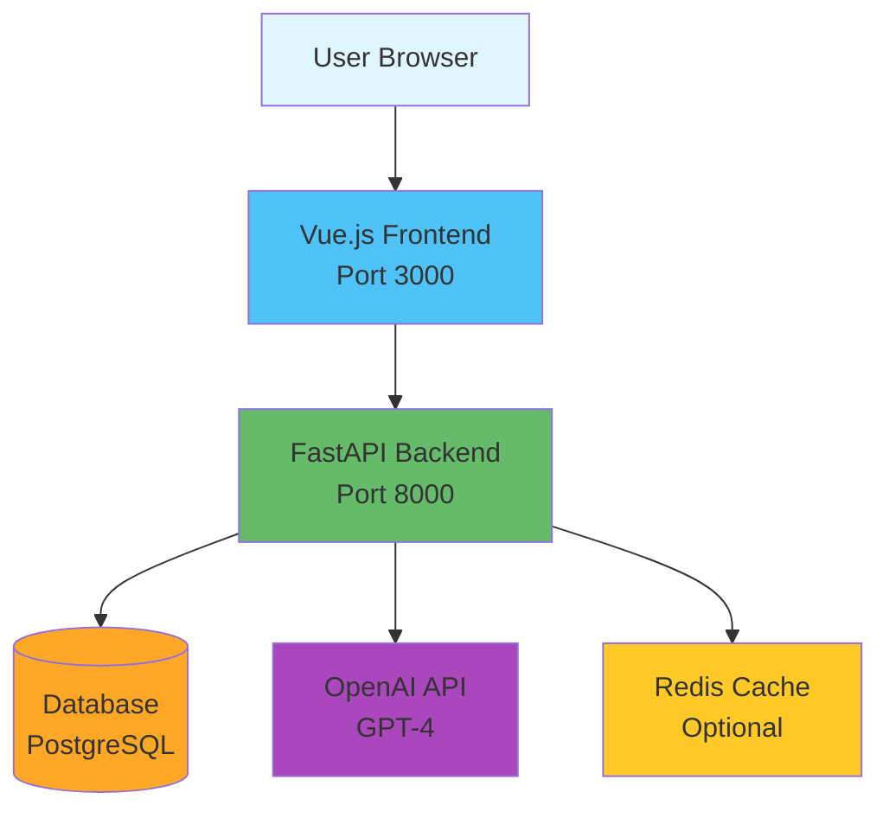
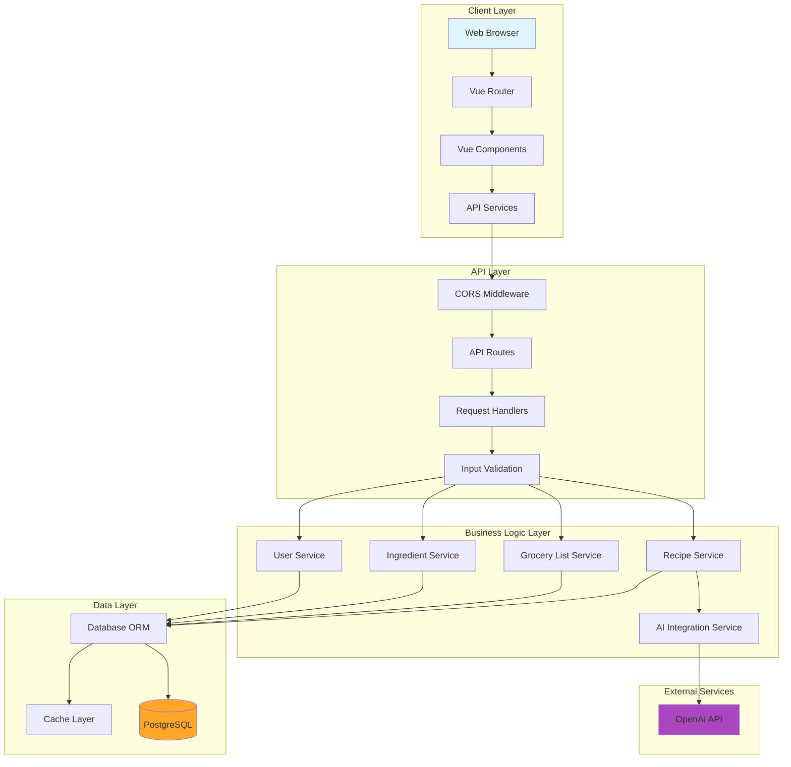
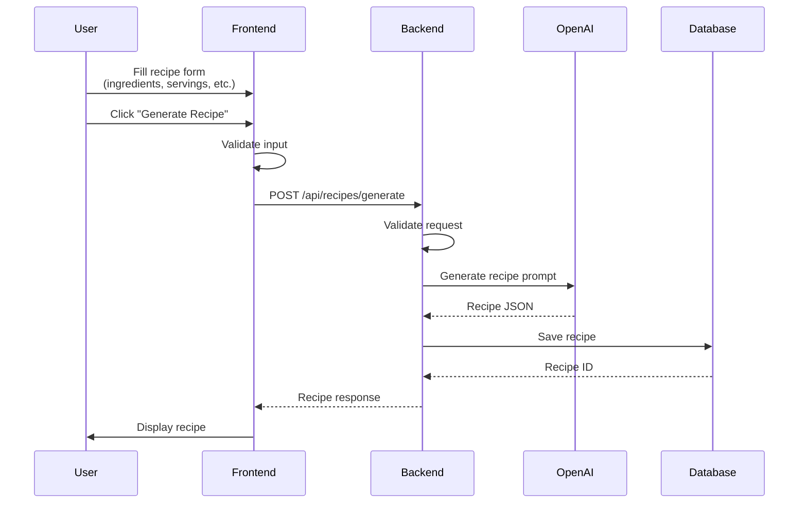
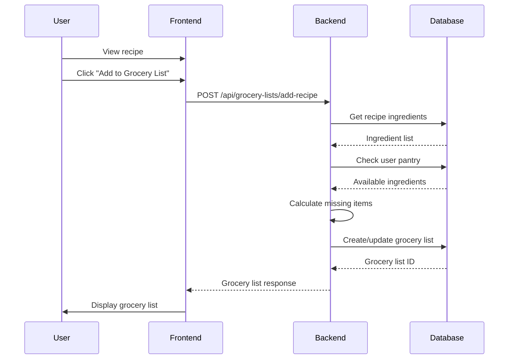
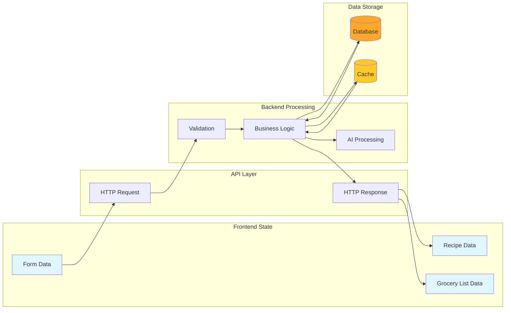
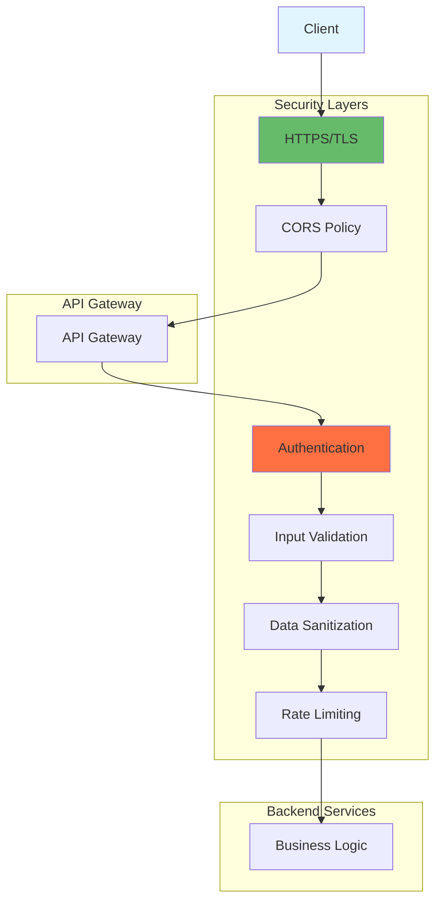
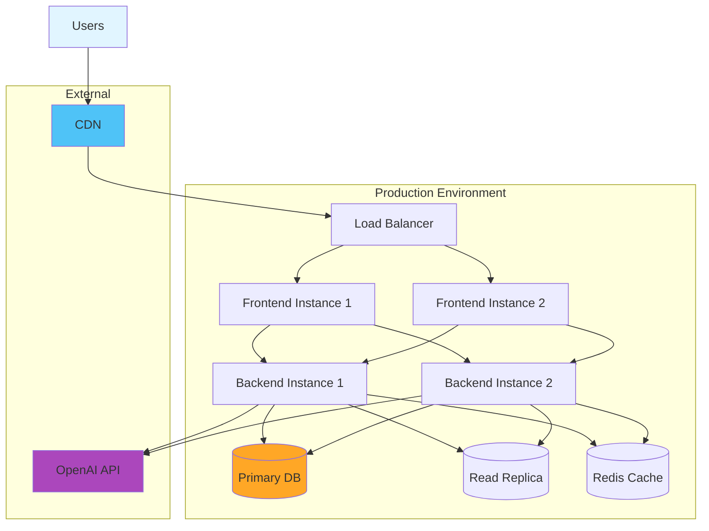
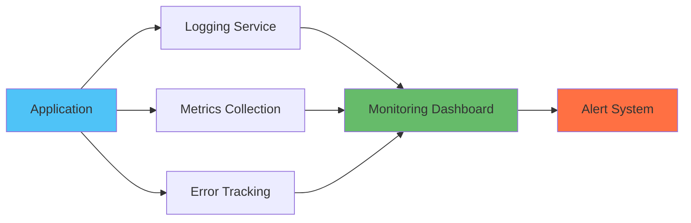

# PrepMate System Architecture

## Overview

PrepMate is a full-stack web application that helps users generate recipes based on available ingredients and create grocery lists. The system uses AI to intelligently generate recipes and manage ingredient inventories.

## Technology Stack

### Frontend
- **Framework**: Vue.js 3 (Composition API)
- **Build Tool**: Vite
- **Routing**: Vue Router 4
- **Styling**: Scoped CSS
- **HTTP Client**: Fetch API
- **Port**: 3000 (development)

### Backend
- **Framework**: FastAPI (Python)
- **Server**: Uvicorn (ASGI)
- **Database**: TBD (Week 4 - recommend PostgreSQL)
- **AI Integration**: OpenAI API
- **Port**: 8000 (development)

### External Services
- **AI Provider**: OpenAI GPT-4
- **Database**: PostgreSQL (planned)

## High-Level Architecture

## Detailed System Architecture

## Component Interaction Flow

### Recipe Generation Flow

### Grocery List Generation Flow

## Data Flow Architecture

## Security Architecture

## Deployment Architecture (Future)

## Key Architectural Decisions

### 1. Separation of Concerns
- **Frontend**: Handles UI/UX, user interactions, and presentation logic
- **Backend**: Manages business logic, data persistence, and external API integrations
- **Database**: Stores persistent data with proper relationships

### 2. RESTful API Design
- Clear resource-based endpoints
- Standard HTTP methods (GET, POST, PUT, DELETE)
- JSON for data exchange
- Stateless communication

### 3. AI Integration Strategy
- Backend handles all AI API calls (keeps API keys secure)
- Caching of common recipe requests to reduce costs
- Fallback mechanisms if AI service is unavailable

### 4. Scalability Considerations
- Stateless backend design for horizontal scaling
- Database connection pooling
- Caching layer for frequently accessed data
- Async processing for long-running tasks

### 5. Security Best Practices
- CORS configuration for frontend-backend communication
- Input validation on both frontend and backend
- Environment variables for sensitive configuration
- API rate limiting to prevent abuse

## Performance Optimization

### Frontend
- Component lazy loading
- Code splitting with Vite
- Image optimization
- Local state management to reduce API calls

### Backend
- Database query optimization
- Response caching
- Async/await for non-blocking operations
- Connection pooling

### Database
- Proper indexing on frequently queried fields
- Query optimization
- Read replicas for scaling reads

## Monitoring & Logging (Future)

## Technology Choices Rationale

### Why Vue.js?
- Gentle learning curve
- Excellent documentation
- Composition API for better code organization
- Strong ecosystem with Vue Router and Vite

### Why FastAPI?
- High performance (based on Starlette/Pydantic)
- Automatic API documentation (Swagger/OpenAPI)
- Type hints for better code quality
- Async support for concurrent requests
- Easy integration with Python AI libraries

### Why PostgreSQL? (Planned)
- Robust relational database
- ACID compliance
- JSON support for flexible data
- Strong community and tooling
- Free and open source

### Why OpenAI?
- State-of-the-art language models
- Reliable API with good documentation
- Structured output capabilities
- Cost-effective for recipe generation
- Easy integration

## Future Enhancements

1. **User Authentication**: JWT-based authentication system
2. **Real-time Updates**: WebSocket support for collaborative features
3. **Mobile Apps**: React Native or Flutter mobile applications
4. **Analytics**: User behavior tracking and recipe popularity metrics
5. **Social Features**: Recipe sharing and community ratings
6. **Search**: Full-text search for recipes and ingredients
7. **Notifications**: Email/push notifications for grocery reminders

## Conclusion

This architecture provides a solid foundation for PrepMate, with clear separation of concerns, scalability in mind, and room for future growth. The tech stack choices balance developer productivity, performance, and maintainability.
