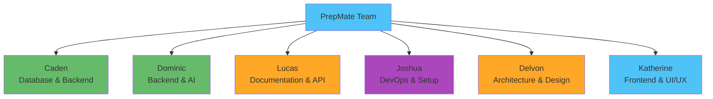
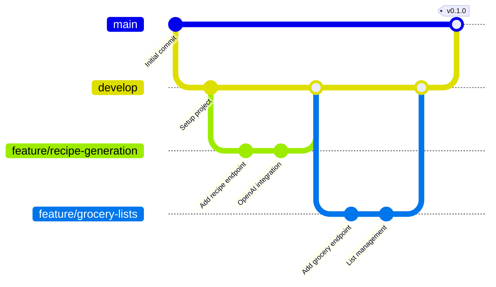
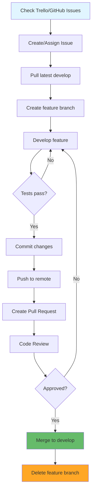
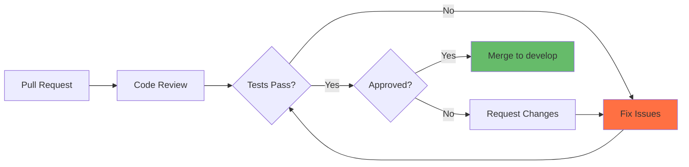
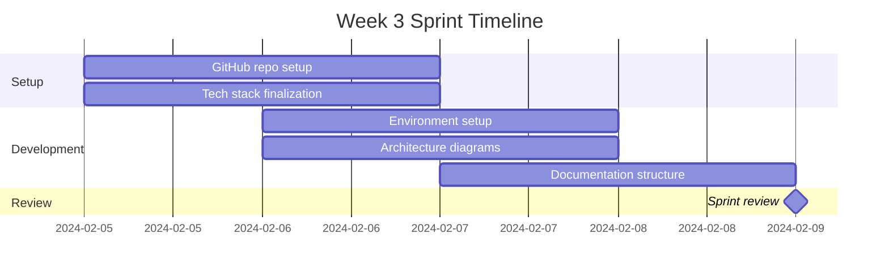

# PrepMate Development Workflow

## Overview

This document outlines the development workflow, branching strategy, code review process, and collaboration guidelines for the PrepMate team.

## Team Structure



## Git Branching Strategy

### Branch Structure



### Branch Types

| Branch | Purpose | Naming | Lifetime |
|--------|---------|--------|----------|
| `main` | Production-ready code | `main` | Permanent |
| `develop` | Integration branch | `develop` | Permanent |
| `feature/*` | New features | `feature/feature-name` | Temporary |
| `bugfix/*` | Bug fixes | `bugfix/bug-description` | Temporary |
| `hotfix/*` | Critical production fixes | `hotfix/issue-description` | Temporary |
| `docs/*` | Documentation updates | `docs/doc-name` | Temporary |

### Branch Naming Rules

✅ **Good Examples:**
```
feature/recipe-generation
feature/user-authentication
bugfix/cors-headers
hotfix/openai-rate-limit
docs/api-documentation
```

❌ **Bad Examples:**
```
my-feature
fix
update
test-branch
```

**Rules:**
- Use lowercase
- Use hyphens (not underscores or spaces)
- Be descriptive but concise
- Include issue number when applicable: `feature/12-recipe-generation`

## Development Workflow

### 1. Starting a New Feature



### Step-by-Step Process

**Step 1: Start from develop**
```bash
# Make sure you're on develop
git checkout develop

# Pull latest changes
git pull origin develop
```

**Step 2: Create feature branch**
```bash
# Create and switch to new branch
git checkout -b feature/recipe-generation

# Or with issue number
git checkout -b feature/12-recipe-generation
```

**Step 3: Make changes**
```bash
# Work on your feature
# Add files, edit code, etc.

# Check status frequently
git status

# See what changed
git diff
```

**Step 4: Commit changes**
```bash
# Stage specific files
git add api/routes/recipes.py
git add api/services/recipe_service.py

# Or stage all changes
git add .

# Commit with descriptive message
git commit -m "feat(recipes): add recipe generation endpoint"
```

**Step 5: Push to remote**
```bash
# Push feature branch to GitHub
git push origin feature/recipe-generation

# Or set upstream and push
git push -u origin feature/recipe-generation
```

**Step 6: Create Pull Request**
- Go to GitHub repository
- Click "Compare & pull request"
- Fill out PR template (see below)
- Request reviewers
- Wait for approval

**Step 7: After merge**
```bash
# Switch back to develop
git checkout develop

# Pull merged changes
git pull origin develop

# Delete local feature branch
git branch -d feature/recipe-generation

# Delete remote feature branch (usually done via GitHub)
git push origin --delete feature/recipe-generation
```

## Commit Message Guidelines

### Commit Message Format

```
type(scope): subject

body (optional)

footer (optional)
```

### Commit Types

| Type | Description | Example |
|------|-------------|---------|
| `feat` | New feature | `feat(recipes): add recipe generation` |
| `fix` | Bug fix | `fix(cors): add missing allowed origin` |
| `docs` | Documentation only | `docs(api): update endpoint examples` |
| `style` | Code style (formatting) | `style(vue): fix indentation` |
| `refactor` | Code refactoring | `refactor(services): simplify error handling` |
| `test` | Add/update tests | `test(recipes): add generation tests` |
| `chore` | Maintenance tasks | `chore(deps): update dependencies` |
| `perf` | Performance improvement | `perf(db): add query indexes` |

### Commit Message Examples

**Good commits:**
```
feat(recipes): implement OpenAI recipe generation

Add OpenAI integration to generate recipes based on user
ingredients. Includes error handling and response parsing.

Closes #12
```

```
fix(groceryList): prevent duplicate items

Fixed bug where adding the same recipe twice created
duplicate grocery list items.

Fixes #25
```

```
docs(integration): add API flow diagrams

Added sequence diagrams showing request/response flow
for all major features.
```

**Bad commits:**
```
❌ update stuff
❌ fixed bug
❌ WIP
❌ asdfasdf
❌ final changes
```

### Multi-line Commits

For complex changes, provide context:
```bash
git commit -m "feat(recipes): add recipe generation" -m "
- OpenAI API integration
- Request validation with Pydantic
- Database model for storing recipes
- Error handling for API failures

This completes the core recipe generation feature.
Closes #12
"
```

## Pull Request Process

### PR Template

```markdown
## Description
Brief description of what this PR does

## Related Issue
Closes #[issue number]

## Type of Change
- [ ] New feature
- [ ] Bug fix
- [ ] Documentation update
- [ ] Code refactoring
- [ ] Performance improvement

## Changes Made
- Change 1
- Change 2
- Change 3

## Testing
- [ ] Tests pass locally
- [ ] Tested with frontend (if applicable)
- [ ] Manual testing completed

## Screenshots (if applicable)
[Add screenshots here]

## Checklist
- [ ] Code follows project style guidelines
- [ ] Self-review completed
- [ ] Comments added for complex logic
- [ ] Documentation updated
- [ ] No console errors
```

### Code Review Guidelines

#### For Authors
1. **Before creating PR:**
   - Self-review your changes
   - Run tests locally
   - Check for console errors/warnings
   - Update documentation if needed

2. **PR Description:**
   - Explain what and why
   - Link related issues
   - Include screenshots for UI changes
   - List breaking changes

3. **During Review:**
   - Respond to feedback promptly
   - Ask questions if unclear
   - Make requested changes
   - Re-request review after updates

#### For Reviewers
1. **What to Review:**
   - Code quality and readability
   - Logic and functionality
   - Error handling
   - Test coverage
   - Documentation updates
   - Performance implications

2. **How to Review:**
   - Be constructive and respectful
   - Explain your reasoning
   - Suggest improvements
   - Approve if looks good
   - Request changes if needed

3. **Review Comments:**
   - Prefix with type: `[suggestion]`, `[question]`, `[blocker]`
   - Be specific about issues
   - Offer solutions when possible

**Good Review Comments:**
```
[suggestion] Consider extracting this logic into a separate function 
for better reusability.

[question] Why did we choose to use a timeout here instead of a promise?

[blocker] This will cause a database error if ingredients is empty. 
Need to add validation.
```

## Merge Strategy

### Merge Methods

**Squash and Merge (Preferred)**
- Combines all commits into one
- Keeps history clean
- Use for feature branches

**Merge Commit**
- Preserves all commits
- Shows full history
- Use for larger features

**Rebase and Merge**
- Applies commits on top of base
- Linear history
- Use carefully

### When to Merge



**Requirements for merging:**
- ✅ All tests pass
- ✅ At least one approval
- ✅ No merge conflicts
- ✅ CI/CD checks pass
- ✅ Documentation updated

## Collaboration Guidelines

### Daily Standup Format

Each team member shares:
1. **What I did yesterday**
2. **What I'm doing today**
3. **Any blockers**

Example:
```
Yesterday: Completed recipe generation endpoint and tests
Today: Working on grocery list integration
Blockers: Waiting on database schema approval from Caden
```

### Communication Channels

| Channel | Purpose | Response Time |
|---------|---------|---------------|
| Slack/Discord | Quick questions, updates | < 1 hour |
| GitHub Issues | Feature requests, bugs | < 1 day |
| Pull Requests | Code review | < 2 days |
| Email | Formal communication | < 1 day |
| Meetings | Sprint planning, reviews | Scheduled |

### Working with Team Members

**Backend Team (Caden, Dominic):**
- Define API contracts before implementation
- Share database schema early
- Coordinate on model changes
- Test endpoints before frontend integration

**Frontend Team (Katherine):**
- Review API documentation
- Provide UI mockups early
- Communicate state management needs
- Share component structure

**Documentation Team (Lucas):**
- Keep docs updated with changes
- Review PRs for documentation needs
- Maintain API examples
- Update architecture diagrams

**DevOps Team (Joshua):**
- Coordinate environment setup
- Share deployment configurations
- Document setup processes
- Help troubleshoot environment issues

**Architecture Team (Delvon):**
- Review design decisions
- Validate architecture patterns
- Provide technical guidance
- Update system diagrams

## Common Workflows

### Syncing with develop

```bash
# On your feature branch
git checkout feature/your-feature

# Fetch latest changes
git fetch origin

# Merge develop into your branch
git merge origin/develop

# Or rebase your changes on top of develop
git rebase origin/develop

# Resolve conflicts if any
# Then push
git push origin feature/your-feature
```

### Fixing Merge Conflicts

```bash
# After git merge/rebase, if conflicts occur:

# 1. See which files have conflicts
git status

# 2. Open conflicted files and look for:
<<<<<<< HEAD
your changes
=======
their changes
>>>>>>> develop

# 3. Edit to keep desired code, remove markers

# 4. Stage resolved files
git add conflicted-file.js

# 5. Continue merge/rebase
git merge --continue
# or
git rebase --continue

# 6. Push changes
git push origin feature/your-feature
```

### Undoing Changes

```bash
# Unstage files
git reset HEAD file.js

# Discard local changes
git checkout -- file.js

# Undo last commit (keep changes)
git reset --soft HEAD~1

# Undo last commit (discard changes)
git reset --hard HEAD~1

# Revert a pushed commit
git revert <commit-hash>
```

### Working with Remotes

```bash
# See remote repositories
git remote -v

# Add remote
git remote add origin https://github.com/team/prepmate-api.git

# Fetch changes from remote
git fetch origin

# Pull changes from remote
git pull origin develop

# Push to remote
git push origin feature/your-feature
```

## Best Practices

### Do's ✅

1. **Commit frequently** - Small, focused commits
2. **Write descriptive messages** - Future you will thank you
3. **Pull before push** - Avoid merge conflicts
4. **Review your own code** - Before creating PR
5. **Test locally** - Before pushing
6. **Keep branches up to date** - Merge develop regularly
7. **Delete merged branches** - Keep repo clean
8. **Use .gitignore** - Don't commit sensitive or generated files
9. **Ask for help** - When stuck or unsure

### Don'ts ❌

1. **Don't commit directly to main/develop** - Always use feature branches
2. **Don't commit secrets** - API keys, passwords, etc.
3. **Don't commit large files** - Images, videos, databases
4. **Don't force push** - Unless you know what you're doing
5. **Don't commit commented code** - Delete it instead
6. **Don't merge without review** - Get approval first
7. **Don't ignore conflicts** - Resolve them properly
8. **Don't commit broken code** - Fix tests first

## Troubleshooting

### Common Issues

**Issue: Forgot to branch from develop**
```bash
# If you made changes on develop by mistake
git stash                          # Save changes
git checkout develop               # Switch to develop
git pull origin develop            # Update develop
git checkout -b feature/new-branch # Create proper branch
git stash pop                      # Restore changes
```

**Issue: Need to update commit message**
```bash
# For last commit (not pushed)
git commit --amend -m "new message"

# For last commit (already pushed)
git commit --amend -m "new message"
git push --force-with-lease origin feature/branch
```

**Issue: Accidentally committed to wrong branch**
```bash
# Reset commit on wrong branch
git reset HEAD~1

# Stash changes
git stash

# Switch to correct branch
git checkout correct-branch

# Apply changes
git stash pop

# Commit
git add .
git commit -m "commit message"
```

## Sprint Workflow

### Week 3 Example



### Sprint Ceremonies

**Sprint Planning (Start of Week)**
- Review sprint goals
- Assign tasks from Trello
- Discuss dependencies
- Set deadlines

**Daily Standups (Every Day)**
- 15-minute check-in
- Share progress and blockers
- Sync on dependencies

**Sprint Review (End of Week)**
- Demo completed work
- Review deliverables
- Gather feedback
- Document learnings

**Sprint Retrospective (End of Week)**
- What went well
- What could improve
- Action items for next sprint

## Conclusion

Following these workflows ensures:
- Clean, maintainable code
- Effective team collaboration
- Minimal merge conflicts
- Professional development process
- Quality deliverables

Remember: Communication is key! When in doubt, ask the team.
