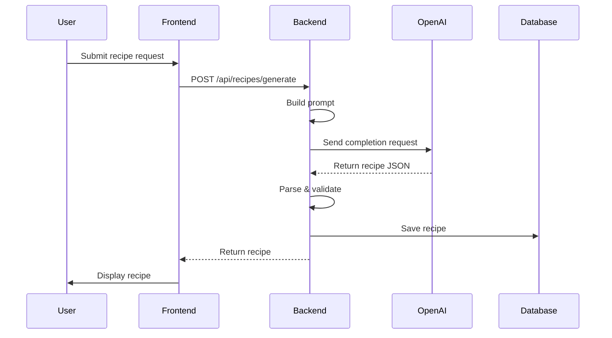

# OpenAI Integration Guide

## Overview

PrepMate uses OpenAI's GPT-4 model to generate recipes based on user-provided ingredients and preferences. This document outlines the integration strategy, prompt engineering, and best practices.

## Why OpenAI?

**Advantages:**
- State-of-the-art language understanding
- Structured output capabilities
- Reliable API with good documentation
- Cost-effective for recipe generation
- Easy integration with Python

**Alternatives Considered:**
- Claude (Anthropic) - More expensive, similar quality
- Gemini (Google) - Less mature API
- Open-source LLMs - Require hosting, less reliable

## Architecture



## Setup

### 1. Install OpenAI SDK

Add to `requirements.txt`:
```
openai>=1.3.0
```

Install:
```bash
pip install openai
```

### 2. Get API Key

1. Sign up at https://platform.openai.com
2. Navigate to API Keys section
3. Create new secret key
4. Copy key (starts with `sk-`)

### 3. Configure Environment

Add to `.env`:
```bash
OPENAI_API_KEY=sk-your-key-here
OPENAI_MODEL=gpt-4
OPENAI_MAX_TOKENS=2000
OPENAI_TEMPERATURE=0.7
```

### 4. Create Service Class

Create `api/services/openai_service.py`:

```python
from openai import OpenAI
from typing import Dict, Any
import json
import os

class OpenAIService:
    def __init__(self):
        self.client = OpenAI(api_key=os.getenv("OPENAI_API_KEY"))
        self.model = os.getenv("OPENAI_MODEL", "gpt-4")
        self.max_tokens = int(os.getenv("OPENAI_MAX_TOKENS", "2000"))
        self.temperature = float(os.getenv("OPENAI_TEMPERATURE", "0.7"))
    
    async def generate_recipe(
        self, 
        ingredients: str,
        servings: int,
        cuisine: str = "",
        dietary: str = ""
    ) -> Dict[str, Any]:
        """Generate a recipe using OpenAI."""
        
        prompt = self._build_prompt(ingredients, servings, cuisine, dietary)
        
        try:
            response = self.client.chat.completions.create(
                model=self.model,
                messages=[
                    {"role": "system", "content": self._get_system_prompt()},
                    {"role": "user", "content": prompt}
                ],
                temperature=self.temperature,
                max_tokens=self.max_tokens,
                response_format={"type": "json_object"}
            )
            
            recipe_json = json.loads(response.choices[0].message.content)
            return self._validate_recipe(recipe_json)
            
        except Exception as e:
            raise OpenAIError(f"Recipe generation failed: {str(e)}")
```

## Prompt Engineering

### System Prompt

The system prompt sets the AI's role and behavior:

```python
def _get_system_prompt(self) -> str:
    return """You are a professional chef and recipe creator. 
    Generate detailed, practical recipes that are easy to follow.
    
    Requirements:
    - Provide realistic cooking times
    - Include accurate ingredient measurements
    - Write clear, step-by-step instructions
    - Calculate nutritional information
    - Ensure recipes are safe and practical
    - Always respond with valid JSON
    
    JSON Format:
    {
      "title": "Recipe name",
      "description": "Brief description",
      "servings": number,
      "prep_time": minutes,
      "cook_time": minutes,
      "difficulty": "easy|medium|hard",
      "ingredients": [
        {
          "name": "ingredient name",
          "quantity": number,
          "unit": "g|kg|ml|l|cups|tbsp|tsp|pieces",
          "category": "protein|grains|vegetables|dairy|spices"
        }
      ],
      "instructions": [
        {
          "step": number,
          "description": "detailed instruction",
          "duration": minutes (optional),
          "temperature": celsius (optional)
        }
      ],
      "nutrition": {
        "calories": number,
        "protein": grams,
        "carbs": grams,
        "fat": grams
      }
    }
    """
```

### User Prompt

Build dynamic prompts based on user input:

```python
def _build_prompt(
    self,
    ingredients: str,
    servings: int,
    cuisine: str,
    dietary: str
) -> str:
    prompt_parts = [
        f"Create a recipe for {servings} servings",
        f"using these ingredients: {ingredients}"
    ]
    
    if cuisine:
        prompt_parts.append(f"Cuisine: {cuisine}")
    
    if dietary:
        prompt_parts.append(f"Dietary requirements: {dietary}")
    
    prompt_parts.append(
        "Include all ingredients (even basic ones like salt, oil)."
    )
    prompt_parts.append(
        "Provide detailed cooking instructions."
    )
    
    return ". ".join(prompt_parts)
```

### Example Prompts

**Simple Request:**
```
Create a recipe for 2 servings using these ingredients: 
chicken, rice, garlic. Include all ingredients. 
Provide detailed cooking instructions.
```

**With Preferences:**
```
Create a recipe for 4 servings using these ingredients: 
pasta, tomatoes, basil, mozzarella. Cuisine: Italian. 
Dietary requirements: vegetarian. Include all ingredients. 
Provide detailed cooking instructions.
```

## Response Validation

### Validate Recipe Structure

```python
def _validate_recipe(self, recipe: Dict[str, Any]) -> Dict[str, Any]:
    """Validate and clean recipe data."""
    
    required_fields = [
        "title", "description", "servings", "prep_time",
        "cook_time", "difficulty", "ingredients", "instructions"
    ]
    
    for field in required_fields:
        if field not in recipe:
            raise ValueError(f"Missing required field: {field}")
    
    # Validate ingredients
    if not recipe["ingredients"] or len(recipe["ingredients"]) == 0:
        raise ValueError("Recipe must have at least one ingredient")
    
    for ing in recipe["ingredients"]:
        if "name" not in ing or "quantity" not in ing:
            raise ValueError("Invalid ingredient format")
    
    # Validate instructions
    if not recipe["instructions"] or len(recipe["instructions"]) == 0:
        raise ValueError("Recipe must have at least one instruction step")
    
    # Calculate total time
    recipe["total_time"] = recipe["prep_time"] + recipe["cook_time"]
    
    return recipe
```

## Error Handling

### Common Errors

```python
class OpenAIError(Exception):
    """Base exception for OpenAI errors."""
    pass

class RateLimitError(OpenAIError):
    """OpenAI rate limit exceeded."""
    pass

class InvalidResponseError(OpenAIError):
    """OpenAI returned invalid response."""
    pass

# Usage in service
try:
    recipe = await openai_service.generate_recipe(...)
except openai.RateLimitError:
    raise RateLimitError("Too many requests. Please try again later.")
except openai.AuthenticationError:
    raise OpenAIError("API key invalid or expired")
except json.JSONDecodeError:
    raise InvalidResponseError("Failed to parse recipe")
except Exception as e:
    raise OpenAIError(f"Unexpected error: {str(e)}")
```

## Cost Optimization

### Strategies

1. **Use GPT-4-Turbo for cost savings**
   ```python
   OPENAI_MODEL=gpt-4-turbo-preview
   ```

2. **Limit max tokens**
   ```python
   OPENAI_MAX_TOKENS=1500  # Reduce from 2000
   ```

3. **Cache common recipes**
   ```python
   from functools import lru_cache
   
   @lru_cache(maxsize=100)
   def get_cached_recipe(ingredients_hash: str):
       # Return cached recipe if available
       pass
   ```

4. **Rate limiting**
   ```python
   from slowapi import Limiter
   
   limiter = Limiter(key_func=get_remote_address)
   
   @app.post("/api/recipes/generate")
   @limiter.limit("10/minute")
   async def generate_recipe(...):
       pass
   ```

### Cost Estimates

**GPT-4 Pricing (as of 2024):**
- Input: $0.03 per 1K tokens
- Output: $0.06 per 1K tokens

**Average Recipe Generation:**
- Input: ~500 tokens (prompt)
- Output: ~1000 tokens (recipe)
- Cost per recipe: ~$0.075

**Monthly estimates:**
- 100 recipes: ~$7.50
- 1,000 recipes: ~$75
- 10,000 recipes: ~$750

## Testing

### Unit Tests

```python
# tests/test_openai_service.py
import pytest
from api.services.openai_service import OpenAIService

@pytest.fixture
def openai_service():
    return OpenAIService()

@pytest.mark.asyncio
async def test_generate_recipe(openai_service):
    recipe = await openai_service.generate_recipe(
        ingredients="chicken, rice",
        servings=2
    )
    
    assert "title" in recipe
    assert "ingredients" in recipe
    assert "instructions" in recipe
    assert recipe["servings"] == 2

@pytest.mark.asyncio
async def test_invalid_ingredients(openai_service):
    with pytest.raises(ValueError):
        await openai_service.generate_recipe(
            ingredients="",
            servings=2
        )
```

### Mock OpenAI for Tests

```python
from unittest.mock import Mock, patch

@patch('openai.ChatCompletion.create')
def test_recipe_generation(mock_create):
    mock_create.return_value = Mock(
        choices=[Mock(
            message=Mock(
                content='{"title": "Test Recipe", ...}'
            )
        )]
    )
    
    # Test your service
```

## Monitoring

### Track Usage

```python
import logging

logger = logging.getLogger(__name__)

async def generate_recipe(self, ...):
    start_time = time.time()
    
    try:
        response = self.client.chat.completions.create(...)
        
        # Log usage
        logger.info(
            f"Recipe generated in {time.time() - start_time:.2f}s. "
            f"Tokens: {response.usage.total_tokens}"
        )
        
        return recipe
        
    except Exception as e:
        logger.error(f"Recipe generation failed: {str(e)}")
        raise
```

### Metrics to Track

- Request count
- Success/failure rate
- Average response time
- Token usage
- Cost per day/week/month
- Error types and frequency

## Best Practices

### Do's ✅

1. **Always validate responses** - Don't trust OpenAI output blindly
2. **Use structured outputs** - Request JSON format
3. **Set appropriate timeouts** - Prevent hanging requests
4. **Implement rate limiting** - Protect against abuse
5. **Cache common requests** - Reduce costs
6. **Log all interactions** - For debugging and monitoring
7. **Handle errors gracefully** - Provide fallback responses
8. **Monitor token usage** - Track costs
9. **Use environment variables** - Never hardcode API keys
10. **Test with real API** - Don't rely only on mocks

### Don'ts ❌

1. **Don't expose API key** - Keep it server-side
2. **Don't ignore rate limits** - OpenAI will block you
3. **Don't skip validation** - AI can make mistakes
4. **Don't use outdated models** - GPT-4 is worth it
5. **Don't forget error handling** - API can fail
6. **Don't over-prompt** - Keep prompts concise
7. **Don't hardcode prompts** - Make them configurable
8. **Don't skip testing** - Test error scenarios

## Advanced Features

### Custom Recipe Styles

```python
RECIPE_STYLES = {
    "quick": "Focus on recipes under 30 minutes",
    "gourmet": "Create restaurant-quality recipes",
    "healthy": "Emphasize nutritional value",
    "budget": "Use affordable, common ingredients"
}

def _build_prompt(self, ..., style: str = ""):
    prompt = f"Create a {style} recipe..." if style else "Create a recipe..."
```

### Multi-Step Recipes

For complex recipes, break into steps:

```python
async def generate_complex_recipe(self, ...):
    # Step 1: Generate recipe outline
    outline = await self._generate_outline(...)
    
    # Step 2: Detail each section
    detailed = await self._add_details(outline)
    
    # Step 3: Add nutritional info
    complete = await self._add_nutrition(detailed)
    
    return complete
```

### Recipe Variations

```python
async def generate_variations(self, recipe_id: str, count: int = 3):
    """Generate variations of existing recipe."""
    
    original = await get_recipe(recipe_id)
    
    variations = []
    for i in range(count):
        variation = await self.generate_recipe(
            ingredients=original.ingredients,
            servings=original.servings,
            additional_prompt=f"Create variation #{i+1}"
        )
        variations.append(variation)
    
    return variations
```

## Troubleshooting

### Common Issues

**Issue: "Invalid API key"**
```
Solution: Check .env file, ensure key starts with 'sk-'
```

**Issue: "Rate limit exceeded"**
```
Solution: Implement exponential backoff, add rate limiting
```

**Issue: "Response not JSON"**
```
Solution: Add response_format={"type": "json_object"} to request
```

**Issue: "Timeout"**
```
Solution: Increase timeout, check network connection
```

**Issue: "Invalid recipe format"**
```
Solution: Improve validation, enhance system prompt
```

## Future Enhancements

1. **Image Generation**: Use DALL-E for recipe photos
2. **Voice Input**: Transcribe ingredients with Whisper
3. **Nutrition Analysis**: More detailed nutritional info
4. **Meal Planning**: Generate weekly meal plans
5. **Dietary Analysis**: Check allergen information
6. **Cost Estimation**: Calculate recipe cost
7. **Shopping Lists**: Smart grocery organization
8. **Recipe Scaling**: Auto-adjust for servings

## Resources

- [OpenAI API Documentation](https://platform.openai.com/docs)
- [OpenAI Python SDK](https://github.com/openai/openai-python)
- [OpenAI Cookbook](https://cookbook.openai.com)
- [Best Practices Guide](https://platform.openai.com/docs/guides/prompt-engineering)

## Conclusion

OpenAI integration is the core of PrepMate's recipe generation. Follow these guidelines to build a reliable, cost-effective, and user-friendly recipe generation system.
